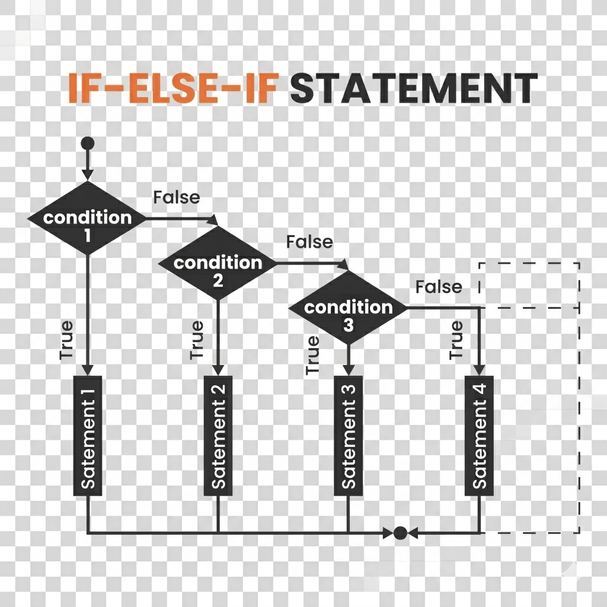

# 📅 Análisis Cronológico de un Año ☕

Este programa realiza un estudio detallado de un año introducido por el usuario, determinando su validez, el siglo al que pertenece y su distancia temporal respecto al año actual. Es un excelente ejemplo de control de flujo y validación de datos en Java.

---

# 📋 Funcionalidades

El programa procesa la entrada bajo las siguientes reglas:

**Validación de Rango**: Solo acepta años entre 1801 y 2100.

**Identificación de Siglo**: Clasifica el año en el Siglo XIX, XX o XXI.

**Cálculo de Distancia Temporal**: 
    * Determina si el año es pasado, futuro o el actual.

    * Calcula la diferencia exacta de años (usando lógica de valor absoluto).

---

# 📂 Estructura del proyecto

```text
AnalisisAnho/
│
├── anho.java
└── README.md
```

---

# ▶️ Compilar el programa

```bash
javac anho.java
```

---

# ▶️ Ejecutar el programa

```bash
java anho
```

---

# 🖥 Ejemplo de Salida

```
ANÁLISIS DEL AÑO
----------------
Introduzca un año (entre 1801-2100): 1802

RESULTADO
---------
El año introducido es anterior al actual. Han pasado 224 años.
El año pertenece al siglo XIX.```

---

# 🎯 Objetivo del ejercicio

* Estructuras Condicionales Anidadas: Uso de if, else if y else para tomar decisiones múltiples.

* Operadores Lógicos: Empleo de || (OR) para la validación de rangos.

* Banderas (Flags): Uso de la variable booleana anyoValido para controlar si se debe ejecutar el procesamiento o mostrar un error.

* Constantes de Configuración: Uso de final int para definir límites (ANYO_MINIMO, ANYO_MAXIMO), facilitando el mantenimiento del código.

---

🚦 Estructuras de Decisión: El condicional if
En Java, utilizamos estas estructuras para que el programa tome diferentes caminos según si una condición es verdadera (true) o falsa (false).

1. El if simple (Validación única)
Se usa cuando solo nos interesa actuar si se cumple una condición. Si no se cumple, el programa simplemente sigue de largo.

Ejemplo en tu código: Cuando compruebas si el año es inválido para cambiar la "bandera" anyoValido.

Java
if (anyo < ANYO_MINIMO || anyo > ANYO_MAXIMO) {
    anyoValido = false; 
}
2. El if-else (Dos alternativas)
Se usa cuando tenemos dos caminos excluyentes: "Si pasa esto, haz A; si no, haz B". Es imposible que se ejecuten ambos a la vez.

Ejemplo en tu código: Al mostrar el resultado final.

Java
if (anyoValido) {
    // Ejecuta todo el bloque de éxito
} else {
    // Ejecuta el mensaje de error
}
3. El if-else if-else (Múltiples alternativas)
Es la estructura que has usado para calcular los siglos o la diferencia de años. Se evalúan las condiciones en orden, de arriba hacia abajo. En cuanto una es verdadera, se ejecuta su bloque y se saltan todas las demás.

**Diferencia clave con el switch**: * El if-else if es mucho más potente porque permite evaluar rangos (ej: anyo >= 1801 && anyo < 1901) y usar operadores lógicos (&&, ||).



El switch normalmente solo sirve para comparar una variable contra valores fijos y exactos (como números enteros, caracteres o Enums).

**Control de Flujo vs. Eficiencia**:
Aunque el switch es más legible para menús o opciones fijas, la estructura if-else if es la herramienta estándar en Java para la validación de rangos numéricos y lógica compleja. En este proyecto se ha priorizado el uso de condicionales encadenados para gestionar con precisión los intervalos de años y las comparaciones de fechas.
---

# 📚 Nota

1. Java es "Case Sensitive"
 * Como nota recordatoria, el identificador ANYO_ACTUAL debe respetarse siempre en mayúsculas tal como se definió. Escribir anyo_actual provocaría un error de compilación.

2. Convención CamelCase
 * Se mantiene el uso de lowerCamelCase para variables de instancia (mensajeSalida, anyoValido).

 * Se utiliza UPPER_SNAKE_CASE para las constantes finales, permitiendo distinguirlas visualmente del resto del código.

 * Se utiliza teclado.nextInt() para capturar la entrada numérica.